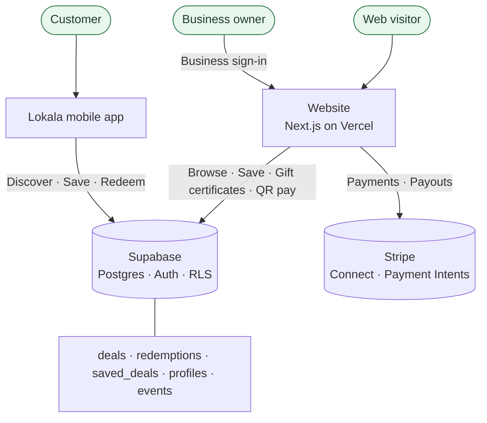

<p align="center">
  
</p>

<h1 align="center">Lokala</h1>

<p align="center">
  <strong>Local deals, rooted in your community.</strong><br />
  The marketplace that keeps Main Street spending on Main Street.
</p>

<p align="center">
  <a href="https://mylokala.com">mylokala.com</a>
</p>

---

## Our mission

Independent businesses are the heart of a community, but they compete for attention
against national chains with national budgets. Lokala gives them a direct line to the
neighbors most likely to walk through their door — and gives shoppers a reason to
choose local first.

We started in the Waterville, Maine area (Mid-Maine), working alongside the
**Mid-Maine Chamber of Commerce**, and we're building the playbook to bring the same
model to communities everywhere.

---

## What we're building

Lokala is a two-sided marketplace connecting local shoppers with the businesses around
them through real, redeemable offers — no flyers, no untracked discounts.

- **Mobile app** — where **customers** discover, save, and redeem deals day to day.
- **Website** (this repo) — the **business and discovery** surface: browse active
  deals, buy gift certificates, pay a business by QR, and onboard as a merchant.

Both surfaces run on one shared backend, so a deal a business publishes is instantly
live everywhere its customers are.

---

## How it works



Businesses publish deals into Supabase; customers discover and redeem them; the website
surfaces the same active deals publicly, handles gift certificates, and takes payments
that route straight to the merchant via **Stripe Connect**.

---

## What Lokala does today

**For shoppers**
- Browse **active deals** pulled live from local businesses.
- **Save deals** to a Lokala account and redeem them, with a running
  **redemption history**.
- **Gift certificates** — send a certificate directly to another Lokala member.

**For businesses**
- A dedicated **business sign-in** and merchant onboarding flow.
- **Get paid by QR** — a customer scans, enters an amount, and funds route to the
  business through its connected Stripe account.
- **Stripe Connect onboarding** so payouts land in the merchant's own bank account.

**Under the hood**
- **Supabase Auth** for sessions and **Postgres + Row Level Security** so access
  matches roles — anonymous visitors can read only **active** deals.
- **Stripe Payment Intents** with `transfer_data` for merchant-destined charges.

---

## Tech stack

| Layer | Choice |
|-------|--------|
| Frontend | **Next.js** (App Router), **React**, **TypeScript** |
| Styling | **Tailwind CSS**, component patterns aligned with **shadcn/ui** |
| Backend | **Supabase** — PostgreSQL, Auth, Storage |
| Payments | **Stripe** — Connect + Payment Intents |
| Theming | **next-themes** with a warm, light community-marketplace design |
| Hosting | **Vercel** — continuous deployment from Git |

---

## Data model

The web app shares the mobile app's schema (the source of truth). See
[`docs/mobile-db-schema.md`](docs/mobile-db-schema.md) for full column details.

| Table | Role |
|-------|------|
| **deals** | Active offers (`business_name`, `title`, `discount_detail`, `category`, `is_active`, `expires_at`, …). Powers the homepage and browse pages. |
| **redemptions** | Per-user redemption history with deal details snapshotted at redeem time. |
| **saved_deals** | Bookmarked deals per user (`user_id`, `deal_id`). |
| **profiles** | Member info (`full_name`, `member_id`, `member_type`). |
| **business_payment_accounts** | Merchant Stripe Connect accounts used for payouts. |
| **business_qr_codes** | Per-business QR codes (`public_code`) that back QR pay. |
| **events** | Chamber / local community events. |

---

## Where we're headed

- **Business dashboards** adapted to the deals schema, with self-serve deal publishing.
- **Community events** surfaced from the `events` table.
- **Payments everywhere** — gift-certificate checkout and in-app pay on the same
  Stripe rails as QR pay.
- **Search & filtering** as the catalog grows.
- **Toast POS integration** — attribute in-store activity to platform-driven visits.
- **New markets** — expand the model beyond Mid-Maine.

---

## For the team

> This is a **proprietary** codebase. It is not open source — please don't redistribute.

The website is a **Next.js** app on **Vercel**, backed by **Supabase** and **Stripe**.
Internal setup notes:

**Prerequisites:** Node.js 20+ and npm.

```bash
npm install
cp .env.example .env.local   # then fill in the values below
npm run dev                  # http://localhost:3000
```

**Environment** — set in `.env.local` (and mirror on Vercel):

- `NEXT_PUBLIC_SUPABASE_URL` — Supabase project URL
- `NEXT_PUBLIC_SUPABASE_ANON_KEY` — Supabase publishable (anon) key
- `STRIPE_SECRET_KEY` — Stripe secret key (Connect enabled)

Point at a Supabase project using the schema in
[`docs/mobile-db-schema.md`](docs/mobile-db-schema.md) and apply the policies under
`supabase/migrations/` so anonymous visitors can read **active** deals.

For architecture and conventions specific to this repo, see
[`AGENTS.md`](AGENTS.md) and [`design.md`](design.md).

---

## Contact

**Lokala** — Waterville, Maine

- **Web:** [mylokala.com](https://mylokala.com)

<sub>© Lokala. All rights reserved.</sub>
