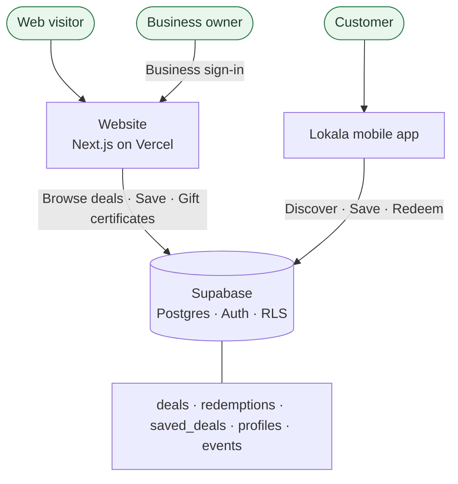

<p align="center">
  
</p>

<h1 align="center">Lokala</h1>

<p align="center">
  <strong>Local deals, rooted in your community.</strong><br />
  A community marketplace connecting Mid-Maine shoppers with the businesses around them.
</p>

<p align="center">
  <a href="https://mylokala.com">mylokala.com</a> ·
  <a href="https://github.com/austin-stanley-hinson/myLokala">Repository</a>
</p>

---

## Overview

Lokala helps independent businesses in the Waterville, Maine area (Mid-Maine) reach
nearby shoppers with real, redeemable offers — no flyers, no untracked discounts.

The product spans two surfaces that share one backend:

- **Mobile app** — where **customers** discover, save, and redeem deals day to day.
- **Website** (this repo) — a **business- and discovery-focused** experience: browse
  active deals, buy gift certificates, learn about Lokala, and onboard a business.

Both surfaces read from the same **Supabase** project. The **mobile app's schema is
the source of truth**, and the web app aligns to it (see
[`docs/mobile-db-schema.md`](docs/mobile-db-schema.md)).

---

## How it works



Businesses publish deals into Supabase; customers browse and redeem them (primarily in
the app); and the website surfaces the same active deals publicly while handling gift
certificates and business onboarding.

---

## Features

**Discovery (public)**
- Browse **active deals** pulled live from the shared `deals` table.
- **Save deals** to a Lokala account (`saved_deals`) when signed in.
- Redeem an offer as a signed-in user, recorded in `redemptions` and viewable under
  **My Redemptions**.

**Gift certificates**
- Choose an amount (defaults to $100) and send a certificate **directly to a
  recipient's Lokala account** — the recipient needs an existing Lokala account to
  receive funds.

**For businesses**
- A dedicated **Business Sign In** and business-oriented sign-up flow. (Owner
  dashboards that depended on the legacy schema are temporarily paused while they are
  re-adapted to the deals model.)

**Platform**
- **Supabase Auth** for sessions, **Postgres + Row Level Security** so access matches
  roles, and a public read policy that exposes only **active** deals to anonymous
  visitors.

---

## Tech stack

| Layer | Choice |
|-------|--------|
| Frontend | **Next.js** (App Router), **React**, **TypeScript** |
| Styling | **Tailwind CSS**, component patterns aligned with **shadcn/ui** |
| Backend | **Supabase** — PostgreSQL, Auth, Storage |
| Theming | **next-themes** with a warm, light community-marketplace design |
| Hosting | **Vercel** — continuous deployment from Git |

---

## Data model

The schema mirrors the mobile app (source of truth). See
[`docs/mobile-db-schema.md`](docs/mobile-db-schema.md) for full column details.

| Table | Role |
|-------|------|
| **deals** | Active offers (`business_name`, `title`, `discount_detail`, `category`, `is_active`, `expires_at`, …). The web app's homepage and browse pages read from here. |
| **redemptions** | Per-user redemption history with the deal details snapshotted at redeem time (`deal_id`, `deal_title`, `business_name`, …). |
| **saved_deals** | Bookmarked deals per user (`user_id`, `deal_id`). |
| **profiles** | Member info (`full_name`, `member_id`, `member_type`). |
| **events** | Chamber / local community events. |

> The legacy `restaurants` and `coupons` tables are no longer used by the web app.

---

## Community

Built for the Mid-Maine / Waterville community, Lokala works alongside the
**Mid-Maine Chamber of Commerce** and local businesses to surface offers and keep
spending close to home. The `events` table backs upcoming chamber and community
listings.

---

## Local development

**Prerequisites:** Node.js 20+ and npm.

1. **Clone and install**

   ```bash
   git clone https://github.com/austin-stanley-hinson/myLokala.git
   cd myLokala
   npm install
   ```

2. **Environment variables**

   Copy `.env.example` to `.env.local` and set:

   - `NEXT_PUBLIC_SUPABASE_URL` — your Supabase project URL
   - `NEXT_PUBLIC_SUPABASE_ANON_KEY` — Supabase publishable (anon) key

3. **Database**

   Point at a Supabase project that uses the mobile schema in
   [`docs/mobile-db-schema.md`](docs/mobile-db-schema.md). Apply the policies under
   `supabase/migrations/` so anonymous visitors can read **active** deals.

4. **Run the app**

   ```bash
   npm run dev
   ```

   Open [http://localhost:3000](http://localhost:3000).

5. **Production build (optional check)**

   ```bash
   npm run build
   npm start
   ```

---

## Deployment

- **Hosting:** [Vercel](https://vercel.com) — production builds deploy from the
  connected Git repository.
- **Backend:** [Supabase](https://supabase.com) — PostgreSQL (data + RLS) and Auth.

Set the same `NEXT_PUBLIC_SUPABASE_*` variables on Vercel as in local `.env.local` so
the deployed app talks to your hosted Supabase project.

---

## Roadmap

- **Re-enable business dashboards** adapted to the deals schema.
- **Surface community events** from the `events` table.
- **Real gift-certificate checkout** with payment processing.
- **Search & filtering** as the deal catalog grows.
- **Toast POS integration** — attribute in-store activity to platform-driven visits.

---

## Author

**Austin Stanley Hinson**

- **GitHub:** [github.com/austinstanleyhinson](https://github.com/austinstanleyhinson)
- **LinkedIn:** [linkedin.com/in/hinson-austin](https://www.linkedin.com/in/hinson-austin/)
- **Portfolio:** [austinhinson.tech](https://austinhinson.tech)
